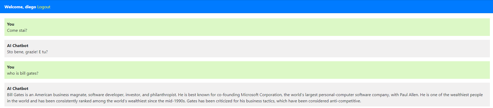

# 🚀 I CREATED A CHAT GPT CLONE USING DJANGO!

This project is a ChatGPT clone built using Python and Django. It incorporates an authentication system that allows users to register and log in. Once logged in, users can interact with the ChatGPT model to ask it various questions or engage in conversations. The application also features a database integration, allowing users to access their entire message history.


I also deployed this project with Vercel! --> 

## Features
1. User Authentication: Users can register an account and log in securely. The authentication system ensures that each user's data is private and protected.
2. Interactive ChatGPT: Logged-in users can engage in conversations with the ChatGPT model. The model can respond to questions, engage in discussions, and provide information.
3. Message History: All user interactions with the ChatGPT model are saved in the database, allowing users to access and review their entire message history.
4. Python and Django: After experimenting with JavaScript, React, Next.js, and Tailwind CSS, this project showcases a return to Python and Django for building a simple but robust web application.

## Installation
1. Clone the repo
2. Navigate to the project directory
3. Create a virtual environment: ```python -m venv venv```
4. Activate the virtual environment:
- On Windows: ```venv\Scripts\activate```
- On macOS and Linux: ```source venv/bin/activate```
5. Install the dependencies: ```pip install -r requirements.txt```
6. Set up the database:
```python manage.py makemigrations```
```python manage.py migrate```
7. Create a superuser for accessing the Django admin panel: ```python manage.py createsuperuser```
8. Run the development server: ```python manage.py runserver```

## Technologies Used
- Python
- Django
- HTML
- CSS
- SQLite 

